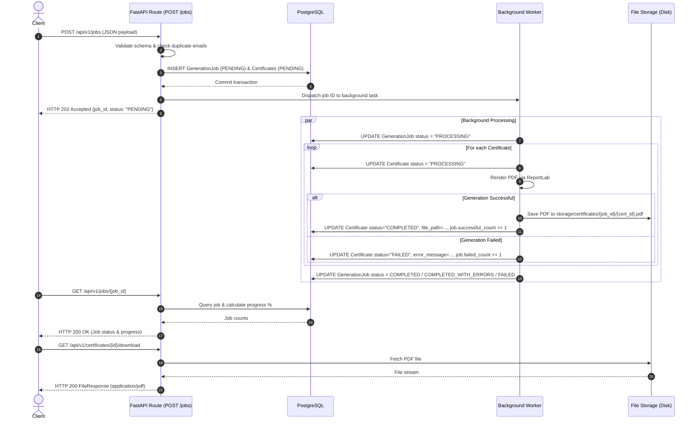

# Bulk Certificate Generator Backend

A high-performance, production-ready Python backend API designed to handle bulk certificate generation at scale. The service validates recipient data, creates an asynchronous background generation job, renders high-resolution PDF certificates using ReportLab, isolates individual failures so batches never fail catastrophically, and serves generated PDF certificates via streaming download endpoints.

---

## 🌟 Key Features

- **Asynchronous Non-Blocking Execution**: Jobs return `HTTP 202 Accepted` immediately, offloading computationally intensive PDF rendering to isolated background workers.
- **Transactional Failure Isolation**: Each recipient's certificate generation runs in its own sub-transaction. A failed certificate (e.g. malformed data or rendering error) will **not** roll back or abort other successful certificates.
- **Accurate Job State Tracking**: Real-time tracking of `total_count`, `successful_count`, `failed_count`, `pending_count`, and calculated `progress_percentage`.
- **Vector PDF Rendering**: High-resolution, professional certificates rendered on-the-fly with ReportLab, featuring multi-tier ornamental borders, verification seals, and unique certificate identifiers.
- **Secure File Storage**: Follows 12-factor application architecture by keeping large binary files on durable filesystem storage (`storage/certificates/{job_id}/{certificate_id}.pdf`) rather than bloating PostgreSQL relational tables.
- **Modular Architecture**: Layered separation of concerns with dependency injection for database sessions and swappable worker abstractions (easily interchangeable with Celery or RQ without altering API routes).
- **Strict Data Validation**: Pydantic v2 validation enforcing email correctness, string sanitization, deduplication of recipient emails per batch, and maximum bulk limits.

---

## 🏗️ Architecture Overview

The application follows a clean, layered architectural design:

```
app/
├── main.py                  # FastAPI application entrypoint, middleware & exception handlers
├── core/
│   ├── config.py            # Pydantic Settings configuration from environment variables
│   └── database.py          # SQLAlchemy 2.x engine, sessionmaker & Base declarative model
├── models/
│   ├── generation_job.py    # GenerationJob model & JobStatus enum
│   └── certificate.py       # Certificate model & CertificateStatus enum
├── schemas/
│   ├── generation.py        # Pydantic schemas for job creation & status responses
│   └── certificate.py       # Pydantic schemas for recipients, certificates & pagination
├── api/
│   └── routes/
│       ├── jobs.py          # API route controllers for /api/v1/jobs
│       └── certificates.py  # API route controllers for /api/v1/certificates
├── services/
│   ├── generation_service.py # Job creation, database queries & pagination logic
│   ├── certificate_service.py# ReportLab PDF template rendering engine
│   └── storage_service.py   # Pathlib-based filesystem storage operations
├── workers/
│   └── certificate_worker.py# Decoupled background task worker & queue abstraction
├── templates/
│   └── certificate_template.pdf # Reference PDF certificate layout
└── utils/
    └── validation.py        # Normalization and string sanitization utilities
```

### Component Flow



---

## 🛠️ Technology Stack

| Layer | Technology |
|---|---|
| **Language** | Python 3.12+ (tested on Python 3.12 & 3.13) |
| **Framework** | FastAPI (ASGI web framework) |
| **Server** | Uvicorn with standard ASGI workers |
| **Database** | PostgreSQL 16 (psycopg 3 driver) / SQLite for fast local tests |
| **ORM** | SQLAlchemy 2.x (Mapped columns & type annotations) |
| **Migrations** | Alembic |
| **Data Validation** | Pydantic v2 & `pydantic-settings` |
| **PDF Generation** | ReportLab 4.x / 5.x |
| **Testing** | Pytest, Pytest-Asyncio, HTTPX / Starlette TestClient |
| **Containerization** | Docker & Docker Compose |

---

## 📋 Prerequisites

- **Python**: Version 3.12 or higher
- **Docker & Docker Compose**: Optional, for containerized execution
- **Git**

---

## ⚙️ Environment Configuration

Configuration is managed through environment variables loaded via Pydantic Settings.

Copy `.env.example` to create your local `.env`:

```bash
cp .env.example .env
```

### Configurable Variables

| Variable | Description | Default |
|---|---|---|
| `DATABASE_URL` | SQLAlchemy connection string | `postgresql+psycopg://postgres:postgres@db:5432/certificate_db` |
| `STORAGE_PATH` | Filesystem path for generated PDFs | `storage/certificates` |
| `MAX_RECIPIENTS_PER_JOB` | Maximum allowed recipients in a single request | `1000` |
| `ENVIRONMENT` | Runtime environment (`development`, `production`, `testing`) | `development` |
| `PROJECT_NAME` | OpenAPI and application title | `Bulk Certificate Generator` |
| `API_V1_PREFIX` | Versioned route prefix | `/api/v1` |

---

## 🚀 Quickstart & Setup

### 1. Running with Docker Compose (Recommended)

Docker Compose starts PostgreSQL and the FastAPI application in isolated containers with automated volume mounting and health checks.

```bash
# Build images and start all services
docker compose up --build -d

# View application logs
docker compose logs -f api

# Stop all services
docker compose down
```

The API is now accessible at `http://localhost:8000`.
Interactive Swagger UI is available at `http://localhost:8000/docs`.

---

### 2. Local Setup (Without Docker)

#### Step 1: Create and Activate Virtual Environment

**On Linux/macOS:**
```bash
python3 -m venv .venv
source .venv/bin/activate
```

**On Windows (PowerShell):**
```powershell
python -m venv .venv
.\.venv\Scripts\Activate.ps1
```

#### Step 2: Install Dependencies
```bash
pip install --upgrade pip
pip install -r requirements.txt
```

#### Step 3: Run Database Migrations
Make sure your PostgreSQL server is running (or point `DATABASE_URL` to SQLite for local development: `DATABASE_URL=sqlite:///./dev.db`).

```bash
alembic upgrade head
```

#### Step 4: Start the Development Server
```bash
uvicorn app.main:app --host 0.0.0.0 --port 8000 --reload
```

---

## 🧪 Running Automated Tests

The test suite covers validation, job lifecycle, concurrent failure isolation, metadata retrieval, pagination, and ReportLab PDF file generation.

```bash
# Run all tests with pytest
pytest -v

# Run with coverage report
pytest --cov=app tests/
```

All tests execute in an isolated in-memory database with temporary file storage fixtures that clean up automatically.

---

## 📖 API Endpoints Reference

### 1. Create Generation Job
- **Method**: `POST /api/v1/jobs`
- **Status**: `202 Accepted`
- **Description**: Validates recipient data and dispatches background generation task.

#### Request Example:
```json
{
  "certificate_title": "Python Specialist Certification",
  "certificate_date": "2026-10-07",
  "recipients": [
    {
      "name": "Alice Johnson",
      "email": "alice@example.com"
    },
    {
      "name": "Bob Smith",
      "email": "bob@example.com"
    }
  ]
}
```

#### Response Example:
```json
{
  "job_id": "c1f7b539-77ba-4ee0-bbd8-4f810aa7fae2",
  "status": "PENDING",
  "total_count": 2,
  "message": "Certificate generation job accepted"
}
```

---

### 2. Get Job Status and Progress
- **Method**: `GET /api/v1/jobs/{job_id}`
- **Status**: `200 OK`
- **Description**: Retrieves real-time job status, completion counters, and percentage progress.

#### Response Example:
```json
{
  "job_id": "c1f7b539-77ba-4ee0-bbd8-4f810aa7fae2",
  "status": "COMPLETED",
  "total_count": 100,
  "successful_count": 98,
  "failed_count": 2,
  "pending_count": 0,
  "progress_percentage": 100.0,
  "created_at": "2026-10-07T01:30:00Z",
  "started_at": "2026-10-07T01:30:01Z",
  "completed_at": "2026-10-07T01:30:15Z",
  "error_message": null,
  "certificates": null
}
```

---

### 3. List Certificates for a Job (Paginated)
- **Method**: `GET /api/v1/jobs/{job_id}/certificates`
- **Parameters**:
  - `page`: Page number (default: `1`, minimum: `1`)
  - `page_size`: Records per page (default: `20`, maximum: `100`)
  - `status`: Optional status filter (`PENDING`, `PROCESSING`, `COMPLETED`, `FAILED`)
- **Status**: `200 OK`

#### Response Example:
```json
{
  "items": [
    {
      "id": "7b8f9e21-0a44-42b7-a02d-083b8b1dc9b2",
      "job_id": "c1f7b539-77ba-4ee0-bbd8-4f810aa7fae2",
      "recipient_name": "Alice Johnson",
      "recipient_email": "alice@example.com",
      "certificate_title": "Python Specialist Certification",
      "certificate_date": "2026-10-07",
      "certificate_id": "CERT-F8E39A2B4C1D",
      "status": "COMPLETED",
      "file_path": "storage/certificates/c1f7b539.../7b8f9e21....pdf",
      "error_message": null,
      "created_at": "2026-10-07T01:30:00Z",
      "completed_at": "2026-10-07T01:30:02Z"
    }
  ],
  "total": 1,
  "page": 1,
  "page_size": 20,
  "total_pages": 1
}
```

---

### 4. Get Certificate Metadata
- **Method**: `GET /api/v1/certificates/{certificate_id}`
- **Parameters**: `certificate_id` (Accepts either database UUID or credential identifier like `CERT-F8E39A2B4C1D`)
- **Status**: `200 OK`

---

### 5. Download Certificate PDF
- **Method**: `GET /api/v1/certificates/{certificate_id}/download`
- **Status**: `200 OK` (`application/pdf`)
- **Error Codes**:
  - `400 Bad Request`: Certificate generation failed (details in response).
  - `404 Not Found`: Certificate or file does not exist.
  - `409 Conflict`: Certificate is still being generated (`PENDING` or `PROCESSING`).

---

## 💻 Sample cURL Commands

### 1. Create a Bulk Job
```bash
curl -X POST "http://localhost:8000/api/v1/jobs" \
  -H "Content-Type: application/json" \
  -d '{
    "certificate_title": "Full-Stack Python Engineer",
    "certificate_date": "2026-10-07",
    "recipients": [
      {"name": "Ada Lovelace", "email": "ada@lovelace.io"},
      {"name": "Alan Turing", "email": "alan@turing.org"}
    ]
  }'
```

### 2. Check Job Status
```bash
curl -X GET "http://localhost:8000/api/v1/jobs/<JOB_UUID>"
```

### 3. List Job Certificates
```bash
curl -X GET "http://localhost:8000/api/v1/jobs/<JOB_UUID>/certificates?page=1&page_size=10"
```

### 4. Download Certificate PDF
```bash
curl -X GET "http://localhost:8000/api/v1/certificates/<CERTIFICATE_UUID>/download" \
  --output certificate.pdf
```

---

## 🏛️ Deep-Dive Architecture Decisions

### 1. Why Asynchronous Background Processing?
Generating a PDF involves raster math, layout calculations, and filesystem I/O. Even at ~15 milliseconds per PDF, generating 1,000 certificates sequentially would block the HTTP connection for **15+ seconds**, causing client gateway timeouts (HTTP 504), exhausting web server thread pools, and degrading latency for all other users.
By creating the records and returning `HTTP 202 Accepted` immediately, the HTTP request completes in single-digit milliseconds, providing a responsive experience.

### 2. Transaction Boundaries and Failure Isolation
Bulk processing should never follow an "all-or-nothing" database transaction. If recipient #499 has an issue, rolling back the preceding 498 successfully generated certificates is unacceptable.
In this architecture:
1. The **initial job creation** commits all records with status `PENDING`.
2. The **worker iterates independently**:
   - Commits `PROCESSING` status for the current certificate.
   - Generates and writes the PDF file.
   - If successful: commits `COMPLETED` and updates job counter.
   - If an exception occurs: catches the error, rolls back only the uncommitted changes for that item, commits `FAILED` with `error_message`, and proceeds immediately to the next recipient.
3. At the end, the job status reflects the combined result:
   - `COMPLETED`: All succeeded.
   - `COMPLETED_WITH_ERRORS`: Some succeeded, some failed.
   - `FAILED`: All failed.

### 3. Filesystem Storage vs. Database BLOBs
Storing PDF binaries directly in PostgreSQL (`BYTEA` columns) degrades database performance:
- It bloats database backups, transaction logs (WAL), and memory cache (`shared_buffers`).
- It puts unnecessary I/O pressure on the relational engine.
- Relational tables are optimized for querying structured tabular data, not streaming binary documents.
Using the filesystem (`storage/certificates/{job_id}/{certificate_id}.pdf`) ensures lightweight database operations, zero database bloat, and fast streaming directly through `FastAPI FileResponse`. In production, this filesystem layer can be swapped with Amazon S3 or Google Cloud Storage by replacing the `StorageService`.

### 4. Worker Decoupling (FastAPI BackgroundTasks vs Celery/RQ)
In Version 1, we implemented the worker using FastAPI `BackgroundTasks` orchestrated through a dedicated `CertificateWorker` service interface (`app/workers/certificate_worker.py`).
- **Why BackgroundTasks for v1**: Lightweight, zero external infrastructure dependencies (no Redis, no RabbitMQ broker needed), and ideal for small-to-medium deployments or test environments.
- **Path to Celery / Distributed Queues**: The worker logic is completely decoupled from FastAPI request handlers. To switch to Celery:
  1. Define a Celery task:
     ```python
     @celery_app.task
     def process_job_task(job_id: str):
         certificate_worker.process_job(uuid.UUID(job_id))
     ```
  2. Change `CertificateWorker.dispatch` to:
     ```python
     process_job_task.delay(str(job_id))
     ```
  The API route (`jobs.py`), schemas, and database layer remain **100% untouched**.

---

## 💡 Scalability Roadmap & Limitations

### Current Implementation Limitations:
1. **Single-Node Execution**: In the default `BackgroundTasks` mode, processing occurs in the process memory of the single API instance. If the container restarts mid-generation, in-flight processing tasks must be recovered.
2. **Local Disk Storage**: PDFs reside on the local volume. If multiple API instances run behind a load balancer without shared storage (like NFS or S3), download requests must hit the node that generated the file.

### Recommended Scalability Improvements:
1. **Distributed Task Queue**: Move to Celery or ARQ backed by Redis to distribute rendering across multiple dedicated worker pods.
2. **Cloud Object Storage**: Implement an `S3StorageService` implementing the `StorageService` interface to stream files directly to and from AWS S3, Cloudflare R2, or Google Cloud Storage with presigned download URLs.
3. **Chunked Database Processing**: For jobs exceeding 10,000 recipients, page queries from the database in chunks of 100 to conserve worker memory.
4. **Dead-Letter Recovery Worker**: A cron scheduler that scans for jobs stuck in `PROCESSING` status for more than 15 minutes and automatically resumes pending items.

---

## 🎯 Technical Interview Questions & Answers

### Q1: Why did you choose HTTP 202 Accepted instead of HTTP 200 OK for the POST /jobs endpoint?
> **Answer**: `HTTP 202 Accepted` explicitly signals to the client that the request has been validated and accepted for processing, but the processing has not been completed. Because certificate generation involves heavy PDF rendering for potentially hundreds of recipients, returning `HTTP 200` would imply all certificates are immediately available. `202 Accepted` establishes an asynchronous polling contract where the client receives a `job_id` to query progress over time.

### Q2: How do you prevent a single failed certificate from rolling back the other certificates in a batch?
> **Answer**: By scoping database transaction boundaries to individual certificates. We persist all records up front in `PENDING` status. Inside the worker loop, we handle each certificate independently inside a `try...except` block:
> - If generation succeeds, we commit `COMPLETED`.
> - If generation fails, we execute `db.rollback()` for any uncommitted changes, record the failure details on the certificate row, commit `FAILED`, and deliberately do not re-raise the exception, allowing the loop to continue with the next recipient.

### Q3: Why should PDF documents never be stored directly in a PostgreSQL table as BYTEA?
> **Answer**: Storing binary documents directly inside PostgreSQL tables causes heavy database bloat. It fills up WAL (Write-Ahead Logs), consumes valuable database memory cache (`shared_buffers`), slows down vacuuming, and inflates backup sizes. Databases are designed for structured relational queries, while filesystems and object stores (like S3) are specifically optimized for sequential high-throughput binary storage and streaming.

### Q4: How is duplicate prevention handled in this system?
> **Answer**: Duplicate prevention is enforced at the validation layer in Pydantic: the `JobCreateRequest` schema validates that all recipient emails within the incoming list are case-insensitively unique before the job is created. At the database level, each generated certificate is also assigned a unique `certificate_id` with a database unique index (`ix_certificates_certificate_id`).

### Q5: How would you scale this application from 1,000 to 1,000,000 certificates per day?
> **Answer**:
> 1. Replace the local `BackgroundTasks` worker with **Celery** or **Kafka** backed by Redis/RabbitMQ.
> 2. Break large jobs into batches of 50–100 recipients and distribute them across an autoscaling pool of Celery worker containers.
> 3. Store generated PDFs in **AWS S3** and generate signed download URLs rather than serving files through the FastAPI application server.
> 4. Add a read replica for PostgreSQL to handle high-frequency status polling queries without impacting write performance.
